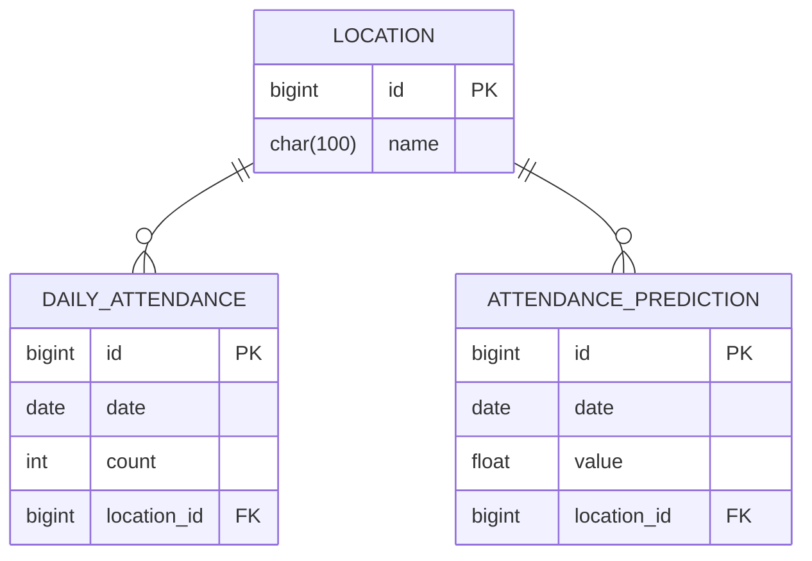

```mermaid
erDiagram

LOCATION {
   bigint id PK
   char(100) name
}

DAILY_ATTENDANCE {
    bigint id PK
    date date
    int count
    bigint location_id FK
}

ATTENDANCE_PREDICTION {
    bigint id PK
    date date
    float value
    bigint location_id FK
}

LOCATION ||--o{ DAILY_ATTENDANCE : ""
LOCATION ||--o{ ATTENDANCE_PREDICTION : ""
```
